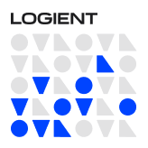
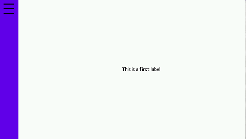
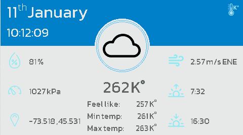

# MicroEJ - Template
### _The rampup_

This project is to explore what can be archived with the [MicroEJ SDK](https://developer.microej.com/get-started/)

### Material ([Documentation](https://github.com/helsing45/MicroEJ-Examples/tree/main/Material))
Provide the core, on how to share the style of in all the application, based on Jetpack compose (android).

### ScrollableList ([Documentation](https://github.com/helsing45/MicroEJ-Examples/tree/main/ScrollList))
Base on the [Demo-Widget](https://github.com/MicroEJ/Demo-Widget/tree/master/com.microej.demo.widget/src/main/java/com/microej/demo/widget/scrollablelist/widget)
### Navigation drawer ([Documentation](https://github.com/helsing45/MicroEJ-Examples/tree/main/NavigationDrawer))
Based on android navigation drawer. This drawer allows you to navigate between different Widget using a side menu.

### Weather ([Documentation](https://github.com/helsing45/MicroEJ-Examples/tree/main/Weather-Demo))

