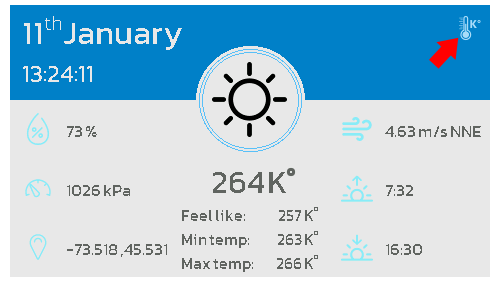

# Weather - demo

This application demonstrates a weather station's user interface. 
This app demonstrates how to implement;
    - Rest api
    - MVC

# Usage

The demo doesn't require much user interaction. However the user can change the format to display the temperature by pressing the icon on the top right.


# Running the app
Before you can launch the application. You must provide an OpenWeather API key.

You will need to add a file :_weatherdemo.properties.list_ into the resource in this file you will need to add:
```
open.weather.app.id={appID}
```
where you replace {appId} with yours ([OpenWeatherMap](https://openweathermap.org/price))

## Run on MicroEJ Simulator

1. Right-click on the project
2. Select **Run as -> MicroEJ Application**
3. Select your platform 
4. Press **Ok**

## Run on device

### Build

1. Right-click on the project
2. Select **Run as -> Run Configuration**
3. Right-click on **MicroEJ Application** configuration kind
4. Click on **New**
5. In **Execution** tab
    1. In **Target** frame, in **Platform** field, select a relevant platform (but not a virtual device)
    2. In **Execution** frame
        1. Select **Execute on Device**
        2. In **Settings** field, select **Build & Deploy**
6. Press **Apply**
7. Press **Run**
8. The application file (`.o` or `.out`) has been generated

### Flash

1. Use the appropriate flashing tool.

# Requirements

This example has been tested on:

* MicroEJ SDK 5.5
* With a platform that contains:
    * EDC-1.3
    * NET-1.1
    * SECURITY-1.3
    * BON-1.4
    * MICROUI-3.0

## Dependencies

_All dependencies are retrieved transitively by Ivy resolver_.